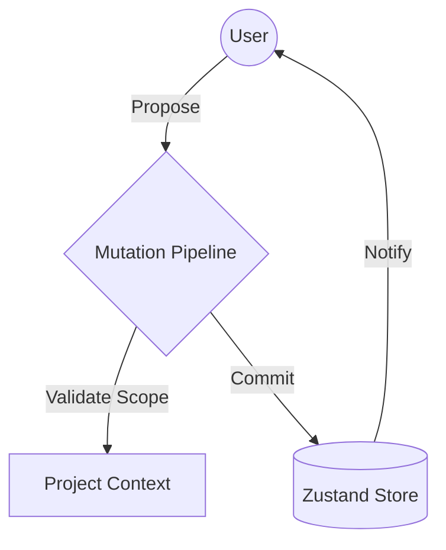
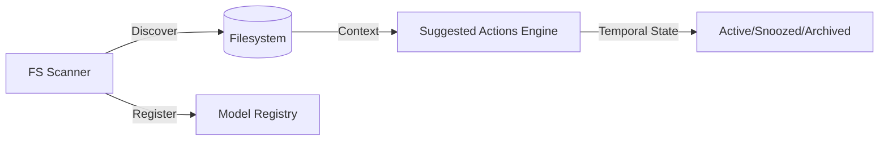
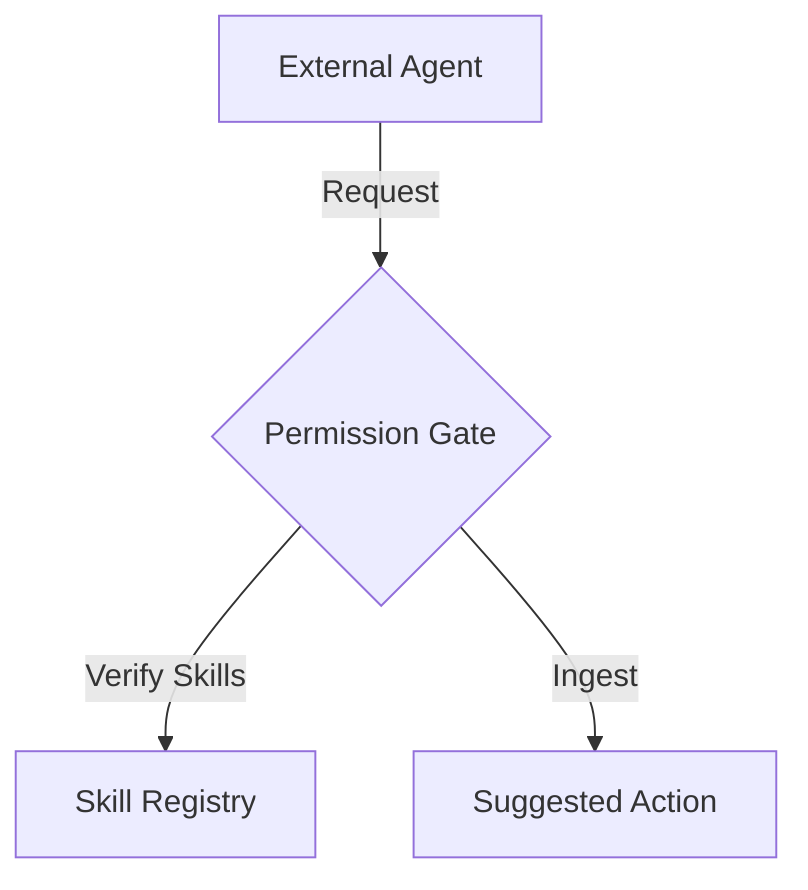
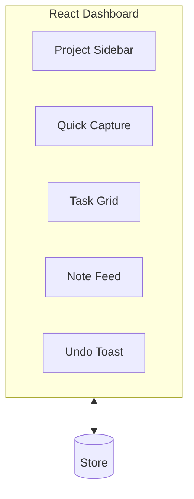

# Continuum: Phase 1-6 Evolution

This document provides visual representations of the Continuum system's growth from a core state engine to a functional, AI-assisted project continuity interface.

## 1. Core Architecture (Phases 1 & 2)
The foundation consists of a strictly serializable Zustand store and a secure "Propose-Commit" mutation pipeline.

## 2. Intelligence & Runtimes (Phases 3 & 4)
Adding the "AI Control Plane" where suggested actions are generated and model runtimes are managed.

## 3. Collaboration & Permissions (Phase 5)
Integrating external agents with a skill-based permission model.

## 4. Minimal Functional UI (Phase 6)
The final realization: a modern React interface for the Pixel 9/10 Pro.

---
*Generated by Gemini CLI - March 31, 2026*
